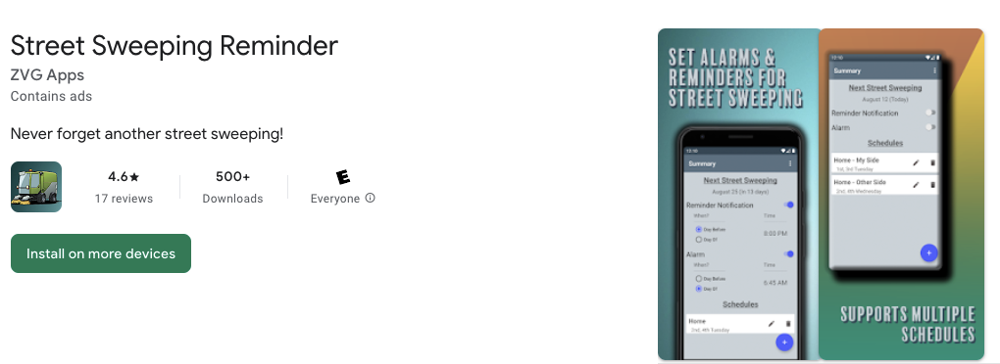
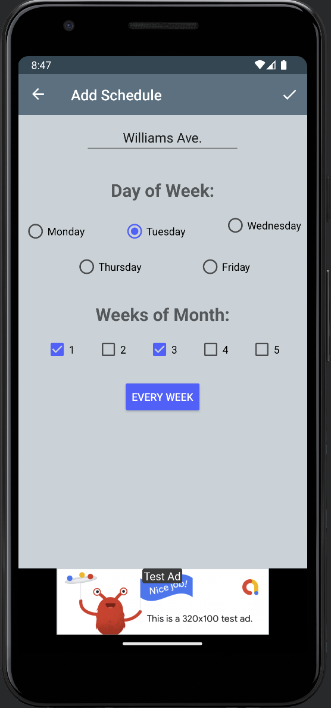
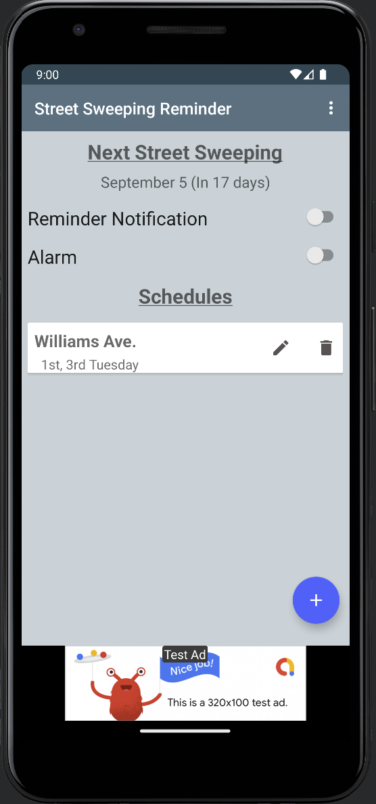
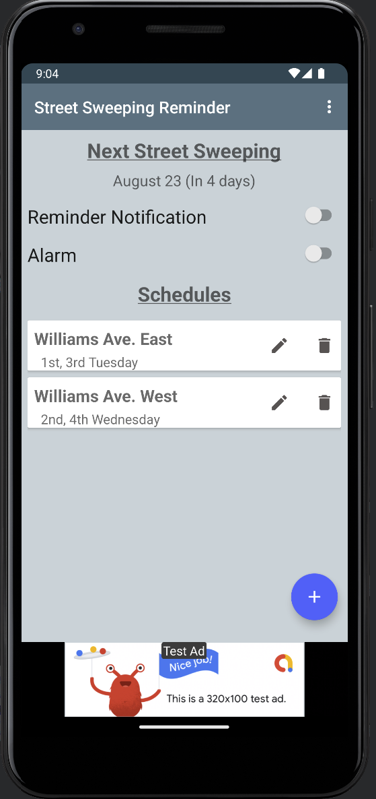
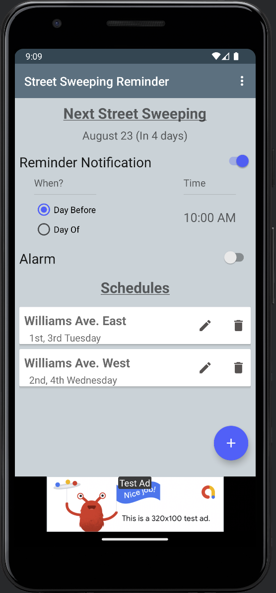
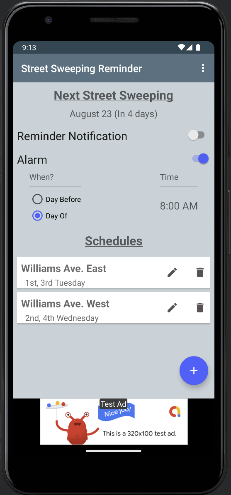
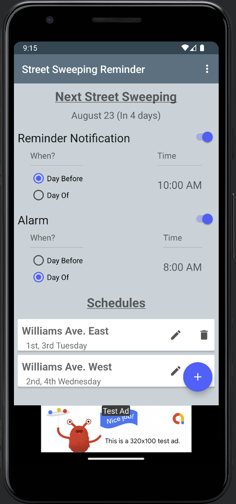
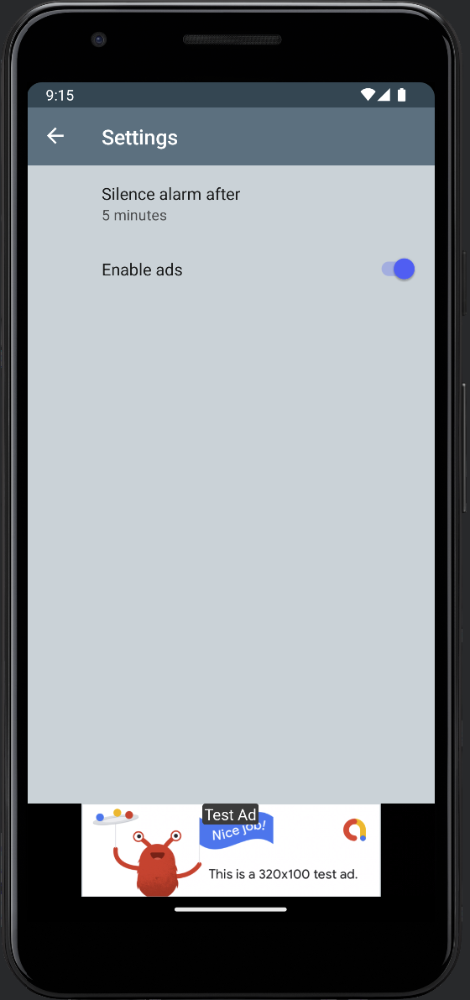

# Street Sweeping Reminder (Android)

*Note: This app was listed on Google Play but has been discontinued.*

## Overview
Set your local street sweeping schedule, and this app will calculate the date of the next street sweeping occurrence, along with the option to set a reminder notification and/or alarm before it. The motivation behind this is that there is no good way to set an event or reminder within Google Calendar (e.g., you can't create a calendar event for something on the first and third Tuesday of the month).

It's built using:
- MVVM
- Kotlin
- Kotlin Coroutines
- View Models
- Room
- Navigation Component
- AdMob Ads
- Gson

## Adding a Schedule
Add a schedule name, select the day of the week, and which weeks of the month sweeping occurs.

## See When The Next Street Sweeping Is
Once a schedule is set, the date of the next occurrence is shown on the main page.

## Multiple Schedules
In some areas, there is street sweeping on one side of the street some weeks and on the other side of the street other weeks. Simply add another schedule, and the main screen will show the date of the next sweeping based on all schedules.

## Set a Reminder Notification
To set a reminder notification, toggle the option on, choose to have the reminder sent the day before or the day of the next sweeping, and the time. This will repeat for every future sweeping date.

## Set an Alarm
To set an alarm, toggle the option on, choose to have the alarm scheduled the day before or the day of the next sweeping, and the time. This will repeat for every future sweeping date.

## Alarm and Notification
The alarm and notification can be enabled at the same time.

## Settings
Choose how long until an alarm is automatically silenced, and if ads should be shown.

